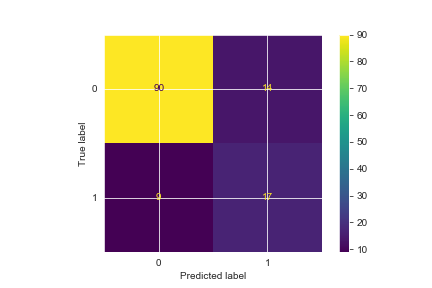

# Factors Predicting Alcohol Consumption in Teens
**Authors** Lhamu Tsering and Eon Slemp

## Overview and Objectives
The purpose of this analysis is to generate insight into factors predictive of teenage alcohol abuse for the New York City Department of Education.   Adolescence is a critical time of neurological development.  During adolescence the brain is fitting itself to the environment to support behaviors that, ideally promote long term thriving.   Patterns of behavior established before the age of 20 will often persist for a lifetime.  The stimulus alcohol, like all addictive substances, causes a kind of hijacking of the behavioral machinery critical to a good life.   Alcohol is the most widely used intoxicant by teenagers and adults.   This analysis will inform policy in ways that can convert to improved life outcomes for individuals served by the New York City Department of Education.

## Optimizing outcomes for New York City Students
The New York City Department of Education serves over one million students annually.  The costs associated with alcohol abuse are wide and deep.  This large public school system has the potential to be a powerful leverage point from which to affect the lives of millions of people.  By identifying high risk students and funneling appropriate resources and interventions in their direction, we can impact millions of individual lives and the character of New York City life in aggregate.  

## The Data
This dataset is sourced from the UCI Machine Learning Repository, ["Student Performance Data Set"](http://archive.ics.uci.edu/ml/datasets/Student+Performance), donated to UCI ML Repo by Prof. Paulo Cortez of University Minho. His original work on the dataset, "USING DATA MINING TO PREDICT SECONDARY SCHOOL STUDENT PERFORMANCE, can be found [here](http://www3.dsi.uminho.pt/pcortez/student.pdf)

For this project we only used the dataset containing students who take the portueguese language course. There are 649 observations and 33 attributes in total. The description for all the features can be found in the Data Dictionary [file](data/Data-Dictionary.md)

## Methods

The Cross-industry standard process for data mining, known as CRISP-DM of process model was followed
1. Business Understanding
2. Data Sourced
3. Data Understanding - Data Cleaning and EDA
4. Data Preparation - Feature Engineering and Feature Selection
5. Modeling - Logistic Regression, KNN, Decision Tree
6. Finding 
7. Recommendations

## Results

The Final Model was a Logistic Regression model with the following metrics:
* Test Accuracy score:  0.82
* Test F1 score:  0.59
* Test Recall score:  0.65 (Focusing on Minimizing False Negatives)

The results of our effort confirms what most people would guess without a machine learning classification study of the data… that a more stable and harmonious home life, higher academic performance, and solid support structures around the student tend to predict lower alcohol consumption.  Less harmonious home life, lower academic performance, with lots of idle time and more active social life tend to predict higher alcohol consumption. 

## Conclusions
Based on the features that produced the best model, the main characteristics influencing alcohol use are listed below. Interventions should aim at several areas that suggest increased risk.
1.  Family life - Resources allocated at higher level than the Department of Education to promote healthy family structures.  Family planning resources and education, and improved access to mental health resources would be two such areas of investment.
2.  Academic support - tutoring, and mentoring, school
3.  Deterrent efforts - Police resources to target those that might provide alcohol to teenagers and enforcing underage drinking laws.
4.  Idle time - After school activities that can engage less motivated students may help to displace drinking as a recreational activity.

## Further Steps
A study designed to reveal the causal relationships among the features would give greater insight into how to prioritize interventions.  My instinct is to say that all of the other observed features derive somehow from the quality of the students’ family environment,  but only a properly designed study can support such a conclusion. 

Although this dataset was very limitedin size it had a lot of good information collected on the attributes, it lacked in mainly number and diversity of observations, to truly generalize on the population. Further steps towards this business problem will be to source data that is reflective of the population of students here in the US.

## For More Information
See the full analysis in the [Jupyter Notebook](notebooks/Student_Alcohol_Consumption.ipynb) 

For additional info, contact :

Lhamu Tsering
Email: boutlhamu@gmail.com 

Eon Slemp 
Email: eonslemp@gmail.com

## Repository Structure

* `Readme.md` : Readme file giving and overview of project
* `Student_Alcohol_Consumption.ipynb` : Main Notebook showing model process
* `EDA.ipynb` : Notebook showing Exploratory Data Analysis
* `student-por.csv` : Data Set csv file
* `images`: Folder containing saved images
